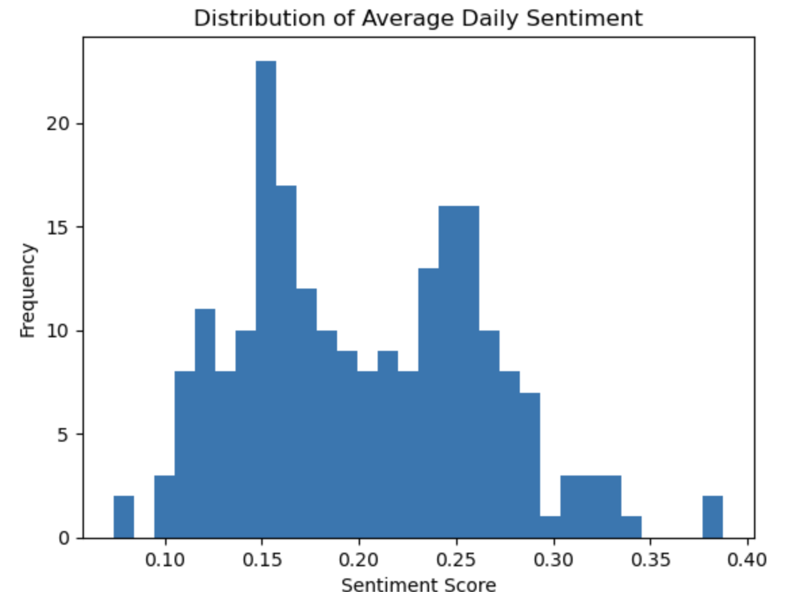
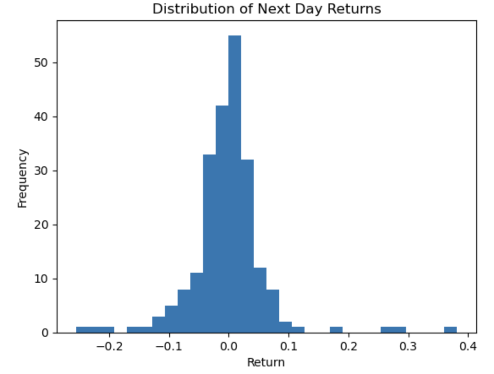
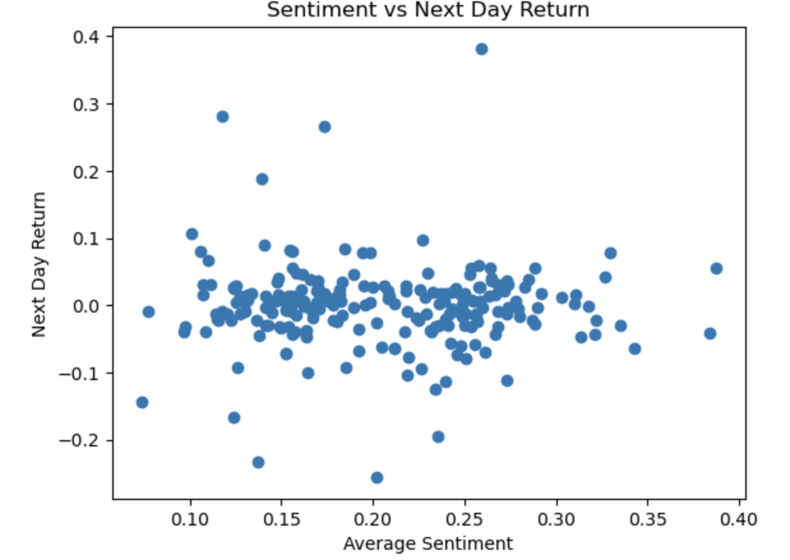
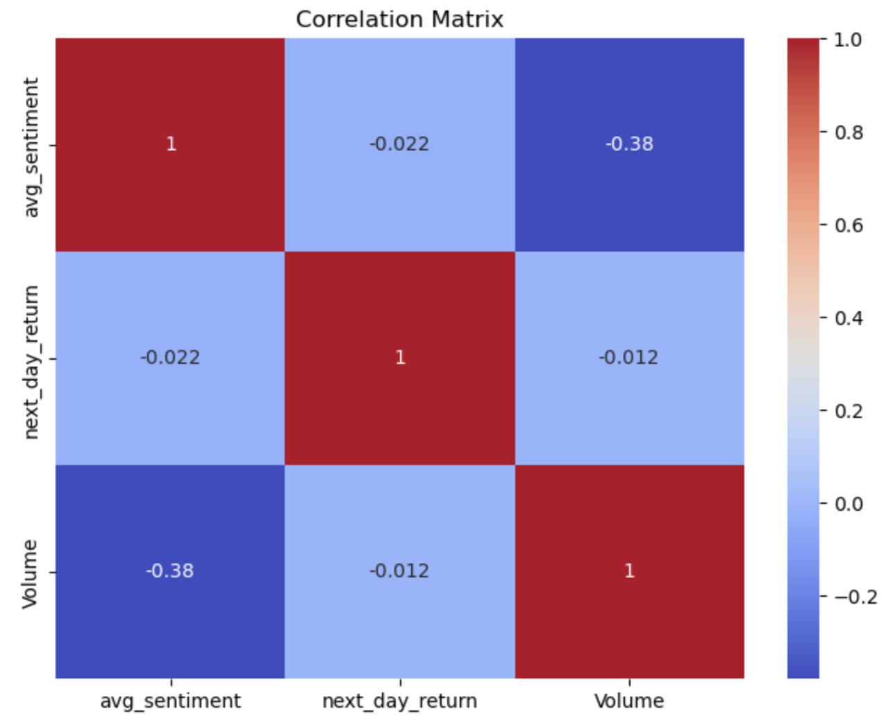
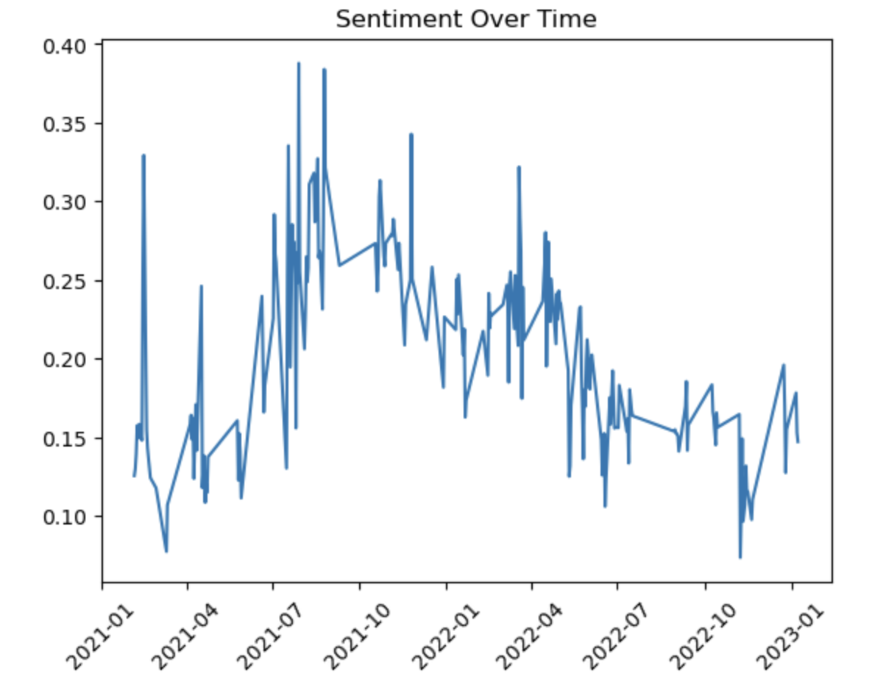
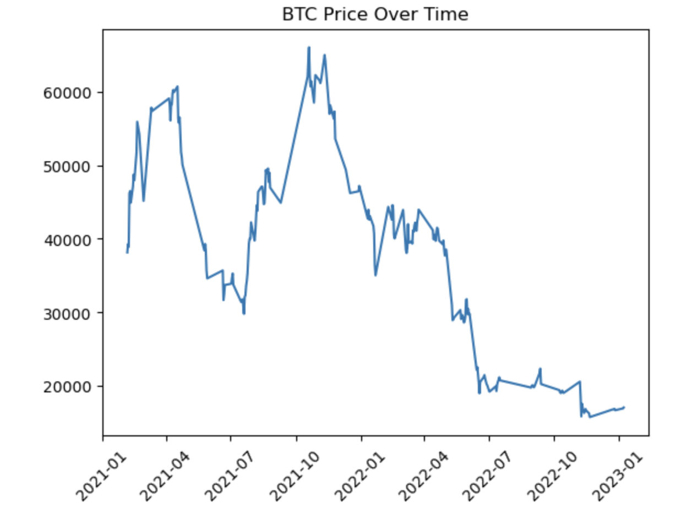

# 📈 Bitcoin Market Direction Prediction using Sentiment Analysis

## 📌 Project Overview

This project predicts the **next-day direction of Bitcoin price (UP or DOWN)** using **Twitter sentiment analysis and machine learning**.

The system combines:

- Public sentiment from Bitcoin-related tweets
- Historical Bitcoin market data
- Market volatility and trading volume

These features are used to train a **machine learning model** that predicts whether the **Bitcoin market will go up or down tomorrow**.

---

## 🚀 Features

- 📊 Sentiment analysis on Bitcoin tweets
- 📈 Bitcoin market data using Yahoo Finance
- 🤖 Machine learning models for prediction
- 📉 Feature engineering on market indicators
- 🌐 Interactive **Streamlit web application**
- ⚡ Real-time prediction using live BTC data

---

## 🧠 Models Used

The following models were tested during experimentation:

| Model | Accuracy |
|------|------|
| Random Forest | 0.43 |
| Logistic Regression | 0.43 |
| XGBoost | **0.49 (Best Model)** |

The final deployed model is **XGBoost**.

---

## 📊 Features Used for Prediction

The model uses the following features:

- `avg_sentiment` → Average tweet sentiment score
- `return_1d` → Previous day price return
- `volatility` → Price volatility
- `volume_change` → Trading volume change
- `log_volume` → Log transformed trading volume

---

## 📂 Dataset

### Tweet Dataset

Source: **Bitcoin Twitter dataset**

Columns used:

- `date`
- `text`

Sentiment scores are calculated using **VADER Sentiment Analyzer**.

---

### Bitcoin Market Data

Market data is fetched using **Yahoo Finance API** via `yfinance`.

Columns used:

- Open
- Close
- High
- Low
- Volume

---

## ⚙️ Feature Engineering

Additional features created:

- Daily average tweet sentiment
- Next day return
- Market volatility
- Volume change
- Log volume transformation

Target variable:  
target = 1 → Price goes UP tomorrow  
target = 0 → Price goes DOWN tomorrow


## 📊 Exploratory Data Analysis

<h3>Sentiment Distribution</h3>


<h3>Next Day Return Distribution</h3>


<h3>Sentiment vs Next Day Return</h3>


<h3>Correlation Heatmap</h3>


<h3>Sentiment Over Time</h3>


<h3>Bitcoin Price Trend</h3>



---

## 🖥️ Streamlit Web App

The project includes a **Streamlit application** where users can input tweets and get predictions.

Users can:

1. Enter tweets related to Bitcoin
2. System calculates sentiment
3. Latest BTC data is fetched automatically
4. Model predicts **tomorrow's market direction**

---


## 📦 Project Structure
bitcoin-market-prediction
│
├── app.py
├── btc_sentiment_model.pkl
├── README.md
├── requirements.txt
│
├── images
│   ├── sentiment_distribution.png
│   ├── return_distribution.png
│   ├── sentiment_vs_return.png
│   ├── correlation_heatmap.png
│   └── btc_price_trend.png


---

## 🛠️ Installation

Clone the repository:

```bash
git clone https://github.com/yourusername/bitcoin-market-prediction.git

Move into the project folder:
cd bitcoin-market-prediction

Install dependencies:
pip install -r requirements.txt


#▶️ Run the Streamlit App
streamlit run app.py


#📊 Example Prediction
Example input tweets:

Bitcoin is going to the moon 🚀
Strong bullish momentum
Market looks very strong

#Example output:
📈 Market Likely UP Tomorrow
Confidence: 63%

---


## 🔮 Future Improvements

Possible improvements for this project:

- Use larger tweet datasets  
- Add transformer models like **FinBERT**  
- Include additional technical indicators  
- Improve feature engineering  
- Use deep learning models (**LSTM**)  
- Hyperparameter tuning  
- Deploy on **Streamlit Cloud**

---

## 🧰 Technologies Used

- Python  
- Pandas  
- NumPy  
- Scikit-learn  
- XGBoost  
- VADER Sentiment  
- yfinance  
- Streamlit  
- Matplotlib  
- Seaborn  

---


---

## 👨‍💻 Author

**Vikash Singh**

Machine Learning Project  
Bitcoin Sentiment Market Prediction

